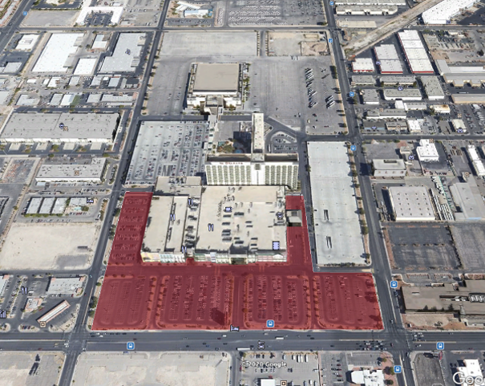
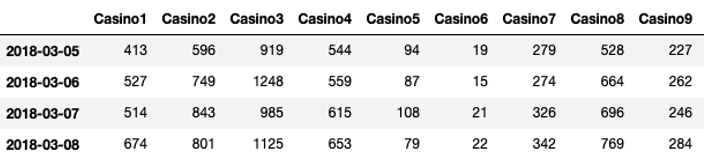
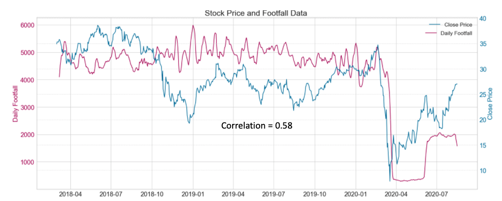
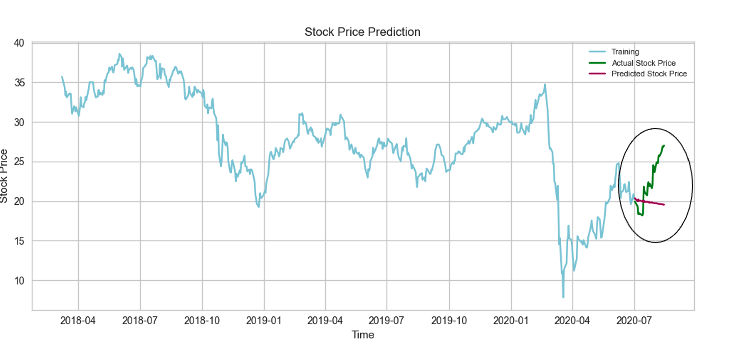
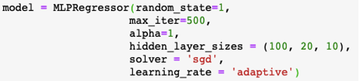
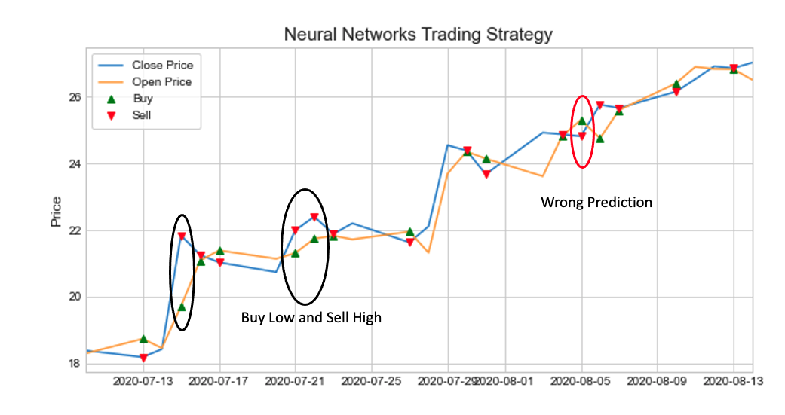
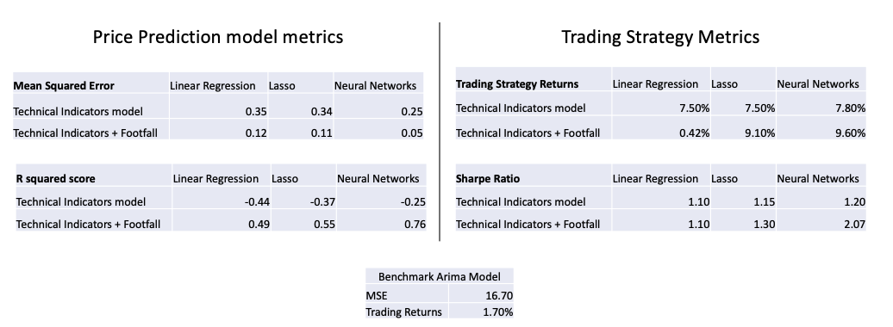

# Trading_Strategy_Using_Satellite_Imagery_Data

## Short Description of the project   
We collected the satellite imagery data for a casino industry stock and created a neural networks based stock price prediction model using the change in footfall at the casinos. This model resulted in a 0.05 mean squared error and 0.75 ajusted R squared. In a long only trading strategy, the monthly reurns turn out to be 9.6% with a 2.1 sharpe ratio. 

## Problem Statement 
Is it possible to use Satellite Imagery data to predict the stock price movement of a casino industry stock ? 

## Business Value
- Geolocation data can help traders make key decisions and this increases the chances of getting positive returns
- In general recreation places like casinos and restaurants usually make more profit when more people visit them. So Intiution wise knowing the number of people who visited the casino can give us an idea if the casino is growing or not. 
- The business value of the project is that if we use the geolocation data correctly, it can help traders get ahead of the market and achieve superior returns 

## Data Collection 

The satellite data that we can get is limited to 2.5 yrs and is mainly focused on the united states and Europe geographies. 
So with regards to this constraint, I chose a stock called Boyd Corporation which did not have any major offshore operations. I did this because I did not want other macroeconomic or geopolitical factors to effect the stock movement. 

Then I researched about the 9 casinos under Boyd corporation and marked them on google earth. You can see the marked location in the picture here. 

Using this marked locations we got the daily footfall data for each of these 9 casinos from the Kayrros platform and this is how the data looks. We have the date and the footfall of each casino on each day. 

## EDA 

- This graph shows the time series plot of the Stock price and daily footfall data. It is observed that there is a 0.58 correlation between the stock and footfall. 
- Although its not high , going with the intuition that the footfall can effect the stock , we want to epxplore the issue further. 

## Benchmark ARIMA model 

STEP 1) Difference the Series to achieve Stationarity

STEP 2) Split the data into train and test set (90:10)

STEP 3) Implementing the appropriate ARIMA(3,1,3) model

STEP 4) Residual Analysis 

STEP 5) Long Only Trading Strategy 

## Machine Learning Models 

### Feature Selection 

1) Technical Indicators: RSI, Volume , MACD
- I have chosen the three technical indicators , RSI , MACD and Volume along with the footfall data to predict the price movement of the stock. 
In the technical indicators , MACD is a lagging indicator which estimates the trend of the stock  and RSI is a momentum indicator which tells us if the stock is underpriced or overpriced and volume tells us about the strength of the market. 

2) Footfall Data : Summation of footfall of all nine casinos 
- For footfall, the individual footfall data for each casino is quite noisy, so I considered the sum of all footfalls on a day as the input feature, to get a better estimate. 

### Feature Engineering / Feature Scaling 

- My idea is to use the past 7 days data of footfall and technical indicators to predict stock price movement on the 8th day. So I created a input feature vector of size 22 by stacking the past 7 days of footfall data and past 5 days of the three technical indicators values. 
- Here you can see 7 days of footfall data but only 5 days ot technical indicator values because footfall is collected even on weekends, but we don’t have stock price data for weekends
- The reason why I chose this form of feature engineering is that , this way the model can easily chose the importance that needs to be given to each input value. 
- You can see here that the data is on different scale so I standardized the data before I give it to the model. 

### Linear Regression Model 

- Train Data gives a MSE of 0.089 and Test data gives a MSE of 0.35. 
- So, the linear regression model is overfitting the train data. 

### Lasso Model 

- The Lasso model was an improvement over linear regression model in terms of similarity in performance across train and test data. But it still has a R squared value close to 0.5 This suggests that there is some non linearity in the data which the Lasso model is not able to capture. 
- It has a marginal improvement over LR model.

- MSE (Train) = 0.45      R squared (Train) = 0.53
- MSE (Test) =  0.11.      R squared (Test) = 0.55 

## Neural Networks Model

1) Standardized data by making mean zero and variance one.  
2) Run basic MLPRegressor model from Sklearn 
3) Performed Hyper Parameter Tuning through Grid Search CV (3 fold Time Series Cross Validation Split)
4) Averaged the results by varying the random seed value

### Long Only Trading Strategy 

- After building the model , I implemented the trading strategy and this is the graph of the long only trading strategy I used. 
- Here in the graph the blue line is the Close price and Orange line is the open price. 
- Each day the model will generate a Buy or sell signal, and based on that we buy at the open price and sell at the close price of that day. 
- Here You can see that the prediction is right in some places where we buy low and sell high and it is wrong in some places. 

## Results 

- Out of the LR , lasso and NN models I see that the NN model has the highest adjusted R squared value of 0.76 and lowest MSE of 0.05. It also gives a 9.6% returns on the long only trading strategy. The Lasso model also does well with similar returns of 9.1% and has the benefit of better explainability than the blackbox NN model. 

## Conclusion 
- Traders can benefit from having Footfall Data as an additional source, but the magnitude of the effect can be confirmed with additional data. 
- The Lasso model and Neural Networks model run well

